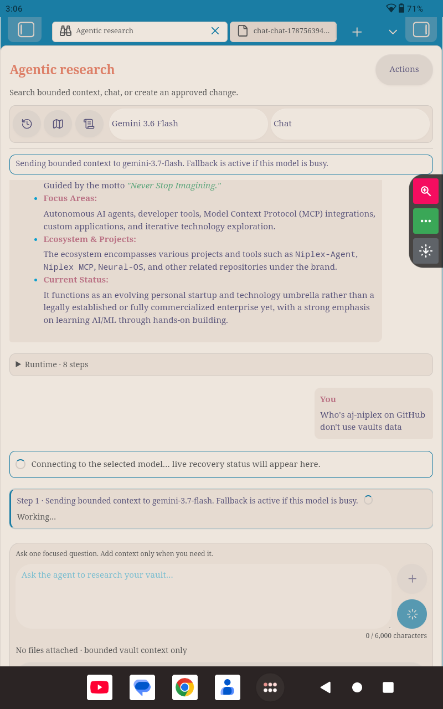
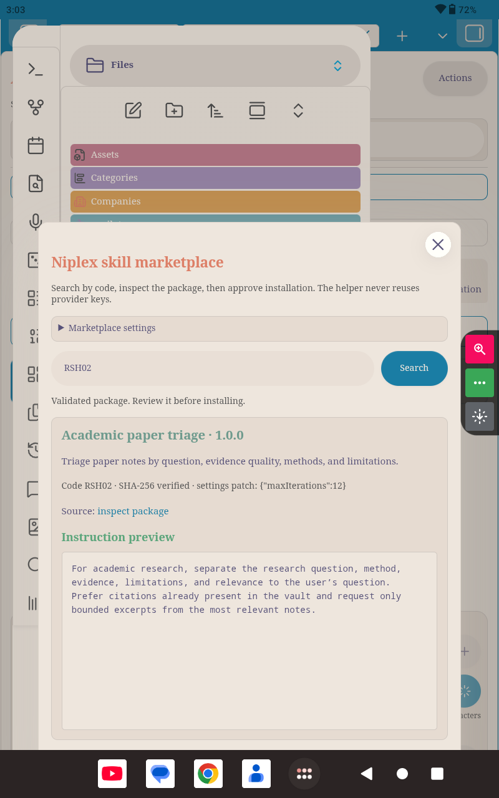
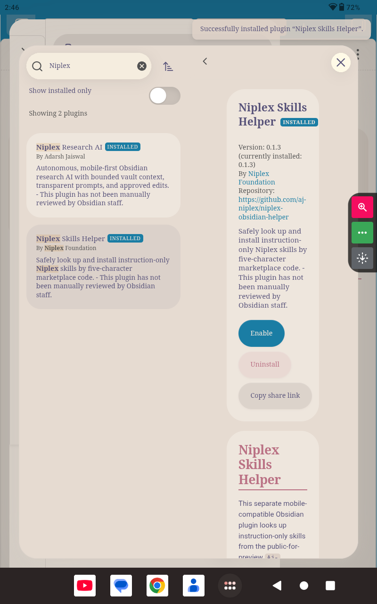
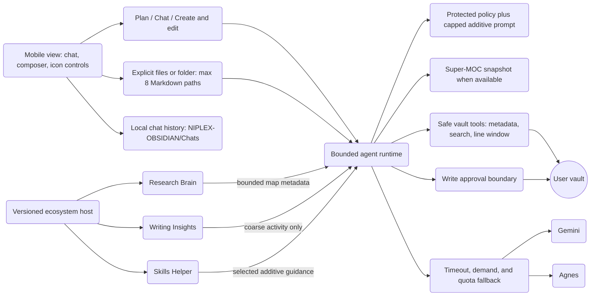
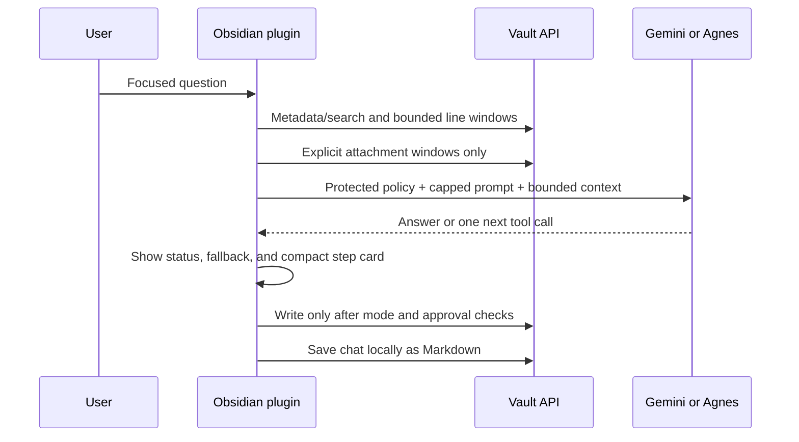

# Niplex Research AI

Niplex Research AI is a mobile-first research assistant for Obsidian. Ask a question about your vault, let the agent search for relevant notes, and follow the evidence without pasting an entire folder into a model request.

I built it around a practical boundary:

> The agent should read what it needs, not receive the whole vault by default.

The plugin searches note names and metadata first, opens bounded line windows when necessary, and keeps durable edits behind an explicit approval step. A super-MOC is a navigation index, not permission to read every note.

## What it does

| Capability | Behavior |
|---|---|
| Autonomous research loop | Plans bounded steps, searches the vault, reads relevant line windows, and returns an evidence-grounded answer. |
| Stoppable runtime | Uses one circular composer button: it sends while idle, becomes Stop during a run, and returns to Send after completion or cancellation. The action timeline preserves a safe stopped summary. |
| Mobile-first workspace | Keeps the conversation and composer visible while secondary tools live behind **Actions**; mobile hides optional shortcut icons to reduce visual clutter. |
| Provider choice | Supports user-entered Gemini and Agnes API keys stored in Obsidian SecretStorage. |
| Recovery from busy models | Rate limits, timeouts, temporary high-demand responses, and unavailable models trigger a visible cooldown and fallback. Gemini tries 3.7, 3.6, 3.6 Flash, 3.5, 3.5 Flash, Gemma 4 31B, then other available top-tier models. |
| Transparent prompt | Shows the protected Aj-Niplex/Niplex policy in a large read-only panel. The additive custom prompt is capped at 6,000 characters and cannot replace the protected policy. |
| Bounded input | Caps the research question at 6,000 characters, installed skill guidance at 6,000 characters, injected context at 20,000 characters, and provider message history at 32,000 characters. |
| Explicit context | The `+` control offers **Files** or **Folder**. A folder adds at most eight Markdown descendants; it does not upload the folder wholesale. |
| Local chat history | Every user turn is saved as readable Markdown under `NIPLEX-OBSIDIAN/Chats/`. The reverse-clock history control opens local search, reopen, and delete actions. |
| Research modes | **Plan** and **Chat** are read-only. **Create & edit** is required before a write tool can be considered, and writes still require approval unless a narrow timed policy is explicitly configured. |
| Quick actions | Users choose up to three icon actions for the left side of the quick bar. The model selector and research-mode selector remain directly beside them. |
| AI-discovered MOCs | Finds categories from bounded note context, allows multi-category membership, and checkpoints long runs so they can resume safely. |
| Skills | The optional helper downloads and installs reviewed instruction-only packages after code lookup, digest verification, preview, and explicit approval. Installed packages appear in the `/skill` selector without requiring a main-plugin restart. |
| Inline controls | Type `@path/to/note.md` or `@Folder/` to add bounded vault context directly. Type `/skill` to choose built-in or installed skills and set answer size from Lowest to Maximum. |
| Public video input | Detects one public YouTube URL in a focused question and sends it to Gemini as a bounded `fileData.fileUri` video part. Agnes receives the URL as text because its current adapter does not claim native video input. |

## Niplex ecosystem host

The core is the host for a broader Niplex ecosystem. Research Brain, Writing Insights, Skills Helper, and future modules remain separate repositories and separate Community plugins, but a compatible host can discover them through the versioned `niplex-ecosystem` protocol. Each extension declares its capabilities and data classes, then registers through a runtime API only when the host is installed and enabled.

Every extension begins with no data permission. The user grants bounded context, note metadata, map provenance, coarse activity, skill guidance, and read-only actions separately. The host applies a per-request item and character budget, labels contributions with provenance, shows an optional context section in the run timeline, and continues normally if an extension is missing, disabled, incompatible, slow, or malformed. Extensions never receive provider keys and cannot use this bridge to write notes or bypass the existing approval boundary.

The approved `0.1.19` release remains an intact rollback point. The ecosystem host and companion-update controls are prepared as the `0.3.0` feature release; users on `0.1.19` continue to have the existing core behavior, while extensions remain usable locally until a compatible host release is installed.

## Companion installation and updates

On first setup, the host checks the allowlisted important companions—Skills Helper and Research Brain—and shows a transparent review panel. The panel explains what each plugin adds, which version is available, what is currently installed, and what the release notes say about user-visible behavior. Nothing is downloaded or enabled until the user selects **Confirm and install important companions**.

After Obsidian starts again, the host can check release metadata for installed companions. If a newer release is available, it shows the release notes and asks before downloading, replacing, or enabling files. The installer downloads only `main.js`, `manifest.json`, and `styles.css`, verifies the downloaded manifest identity and version, disables an already-running companion during replacement, and restores the previous files when installation fails where possible. Users can defer any update and manage optional companions such as Writing Insights and Iconize from Settings.

The reminder is a foreground in-app interval while Obsidian is running; it is not a hidden background service and does not run while the mobile app is suspended or closed. Users can turn off important-companion reminders or restart-time checks in Settings. The core never silently installs a plugin.

## Mobile interaction model

The main view keeps the conversation visible and moves less frequent controls behind **Actions**. On mobile, optional shortcut icons are collapsed so the screen stays focused; model and research mode remain available in the compact control row. The composer stays at the bottom: the text field is on the left, with context and one stateful send/stop control on the right. While a run is active, that same button becomes a red **Stop** control and returns to Send when the run ends.

Type `@` followed by an exact Markdown path or vault folder path to add it directly to the next run. The parser resolves only safe vault-relative paths, limits the result to eight Markdown files, and leaves unresolved mentions as normal text. Type `/skill` to open the mobile skill selector, choose skills, and set the answer-size preference without leaving the composer. Helper-installed skills are refreshed from `NIPLEX-OBSIDIAN/Skills/` each time the selector opens.

Tap `+` to choose **Files** or **Folder**. A folder contributes at most eight Markdown paths; it is not uploaded wholesale. The **Actions** sheet contains MOC building, saved-chat management, prompt inspection, logs, and quick-action configuration.

## Mobile screenshots

The following captures show the mobile interaction model, helper marketplace, inline skill command, and Obsidian installation flow. Runtime cards are action summaries rather than private chain-of-thought, and the Stop control appears while a run is active.








## Latest release notes

### 0.3.1 — Companion settings action fix

When a companion is already installed but disabled, the Settings manager now opens Obsidian’s Community plugins screen instead of presenting an inactive installation action. This keeps enabling visible and user-controlled.

### 0.3.0 — Ecosystem host and companion update controls

This feature release adds explicit extension discovery, deny-by-default permissions, bounded context requests, read-only extension actions, provenance labels, timeouts, and failure isolation. It also adds a transparent first-run companion installer, allowlisted release checks on restart, explicit confirmation before downloads or enabling, rollback-aware replacement, and expandable release notes explaining what changed and how each update affects the user. It never silently downloads, enables, or executes another plugin.


### 0.1.19 — Community review warning cleanup

This patch removes three non-blocking automated-review warnings: it avoids an unsafe-looking activity lookup, uses a standard grid gap declaration for older host compatibility, and replaces placeholder-style installation wording in the README. The release retains the corrected manifest description, Compact/Comfortable/Spacious chat-window profiles, stoppable runtime, bounded note context, inline commands, and skill controls.

## Architecture



### Context boundary



## Installation

The easiest route is **Settings → Community plugins → Browse**. Search for **Niplex Research AI**, install it, enable it, and open the plugin.

For manual testing, download `main.js`, `manifest.json`, and `styles.css` from the [GitHub releases page](https://github.com/Aj-Niplex/Niplex-obsidian-Research-AI/releases). Put them in:

```text
MyVault/.obsidian/plugins/niplex-agentic-research/
```

Reload Obsidian, enable **Niplex Research AI**, and complete the walkthrough. The [development repository](https://github.com/Aj-Niplex/Dev-obsidian-agentic-research) is private; the product repository is public.

```bash
git clone https://github.com/Aj-Niplex/Niplex-obsidian-Research-AI.git
cd Niplex-obsidian-Research-AI
npm install
npm run build
```

The build creates `main.js`. Copy it with `manifest.json` and `styles.css` into the plugin folder shown above.

## First-run setup

The walkthrough checks for **Niplex Skills Helper** and **Iconize**. Both are optional to the main research view. If one is missing or outdated, the walkthrough provides an install or update link; it does not silently download or enable another plugin.

The walkthrough also asks where MOCs should live. Choose either `MOCs/` at the vault root or `NIPLEX-OBSIDIAN/MOCs/`. That choice becomes the default for later MOC creation and adjustment. After the choice is saved, the MOC builder opens and starts automatically. You can minimize its window, but keep it open until the run finishes.

For a cleaner Graph View, you may exclude `NIPLEX-OBSIDIAN/` manually in **Graph View → Filters → Excluded folders**. The plugin does not change that global setting.

For development, clone the repository, install dependencies, and run the local checks:

```bash
npm install
npm test
npm run build
npm run validate
```

No GitHub Actions workflow or paid runner is required. The local validation script is authoritative for this project.

## Provider setup and recovery

Choose a provider in settings and enter its key through Obsidian’s SecretStorage-backed field. Refresh the provider catalogue before selecting a model. A globally listed model is not proof that the current API key can use it, so the plugin replaces an inaccessible configured model with an account-visible candidate when possible.

When a model is rate-limited, times out, reports temporary high demand, or is unavailable, the transcript immediately shows the model name, reason, cooldown period, and next fallback attempt. The user can retry the last request directly from the error card or switch the model from the quick bar. Authentication and malformed-request errors remain visible as actionable failures instead of being silently retried.

## Public YouTube sources

Paste one public YouTube URL into a focused question, for example, `https://youtu.be/VIDEO_ID`, and ask for a summary, timestamp question, or evidence extraction. The plugin canonicalizes the URL and sends it to Gemini using the documented `fileData.fileUri` video input. The URL is not downloaded into the vault, and no private or unlisted video is accepted by the URL parser. Gemini’s public-video processing limits and account quota still apply.

Agnes remains available for text and vault research, but its current adapter does not advertise native video parts. When Agnes is selected, the transcript explicitly says that the link is being treated as text and recommends switching to Gemini for direct video analysis. This plugin cannot call the host assistant’s private tools; it uses only the providers and vault tools configured inside the plugin.

## User-owned workspace

The plugin keeps its user-facing files in one visible vault folder:

```text
NIPLEX-OBSIDIAN/
├── Chats/       # Readable saved conversations
├── Memory/      # User-visible personalization memory
├── MOCs/        # Generated maps when this location is selected
├── Prompts/     # Additive custom prompt mirror
├── Runtime/     # Protected checkpoints and diagnostics
└── Skills/      # Validated helper-installed skill packages
```

API keys are not stored in this folder. The agent cannot read the protected chat, prompt, memory, runtime, or installed-skill folders through its vault tools by default. Generated MOCs remain navigable so they can serve as user-controlled research indexes.

For a cleaner visual graph, manually add `NIPLEX-OBSIDIAN/` to **Graph View → Filters → Excluded folders**. The plugin explains this during onboarding but does not silently change Obsidian’s global Graph View settings.

## Prompt transparency and limits

The **System prompts** view presents the built-in Aj-Niplex/Niplex policy in a large read-only showcase. It explains bounded context, untrusted vault text, privacy boundaries, and approval behavior. The UI cannot edit or override this protected policy, and the runtime removes historical system messages before injecting exactly one protected policy message at the start of every run.

The user prompt is additive preference text only. It is capped at 6,000 characters, displays a live counter, and is mirrored locally under `NIPLEX-OBSIDIAN/Prompts/`. Provider tokenization differs by model, so the character limits are deliberately conservative rather than pretending to be an exact token count.

## MOCs and long runs

The MOC builder discovers categories from bounded note metadata and excerpts. A note can belong to multiple categories, and every category receives a short summary. The builder writes category notes and a super-MOC under the configured visible MOC folder. It checkpoints after each note, shows progress, pauses after the current note, and resumes without reprocessing completed notes.

A MOC is a navigation aid, not a whole-vault export. The regular agent still chooses relevant files and reads bounded windows rather than sending every note body in one request.

## Skills and helper plugin

The optional Niplex Skills Helper (https://github.com/Aj-Niplex/niplex-obsidian-helper) provides the marketplace surface. Its default public catalogue is:

```text
https://raw.githubusercontent.com/Aj-Niplex/Niplex-Obsidian-skills/main/catalogue.json
```

Enter a five-character code such as `RSH01`, inspect the returned package, and explicitly approve installation. The helper verifies a SHA-256 digest and writes only `skill.json` and `SKILL.md` into `NIPLEX-OBSIDIAN/Skills/`. After installation, reopen `/skill` in Research AI to refresh the list immediately; a full restart is still safe but is not required for discovery. The main plugin loads the package as untrusted additive guidance and applies only allowlisted numeric settings patches. The public catalogue includes nine reviewed research packages (`RSH01`–`RSH09`). The upstream Hermes research directory is vendored under the catalogue repository for inspection with its MIT notice preserved, but it is not a live runtime dependency. Bundled upstream scripts are not executed by Niplex.

## Privacy and security

For a run, the plugin sends the focused question, the protected policy, the capped custom prompt, bounded context selected for that request, bounded tool results, and compact conversation history to the configured provider. It does not upload the whole vault. Write tools are separated from read-only tools and are blocked outside **Create & edit** mode.

Diagnostics are intentionally redacted. They may include provider/model events, cooldowns, timeouts, and short error summaries, but not API keys, prompts, model responses, or vault excerpts. Users should still review a diagnostics export before sharing it.

## Current limitations

This is still an active project, so real Android and iOS testing matters. The areas most worth checking are SecretStorage, modal sizing, long MOC runs, local chat migration, provider fallback, public YouTube handling with Gemini, and helper updates. The plugin does not run background jobs or automatic vault hooks.

## Repository layout

```text
src/
├── core/
│   ├── agent-runtime.ts       # Bounded tool loop, mode enforcement, and fallback events
│   ├── context-budget.ts      # Shared input-size limits
│   ├── local-vault-store.ts   # User-owned chats, prompts, and skills
│   ├── moc-organizer.ts       # Incremental category discovery and checkpointing
│   ├── system-prompt.ts       # Protected policy and additive prompt composition
│   └── vault-context.ts       # Safe metadata, search, reads, and writes
├── providers/
│   ├── gemini.ts              # Gemini adapter and account-visible catalogue
│   └── agnes.ts               # Agnes adapter and catalogue
├── ui/
│   ├── agent-view.ts          # Mobile workspace and composer
│   ├── action-sheet-modal.ts  # Progressive-disclosure Actions surface
│   ├── attachment-choice-modal.ts
│   ├── chat-history-modal.ts
│   └── file-picker-modal.ts
└── main.ts                    # Obsidian lifecycle and host boundary
```

## License

MIT. See [LICENSE](LICENSE).
