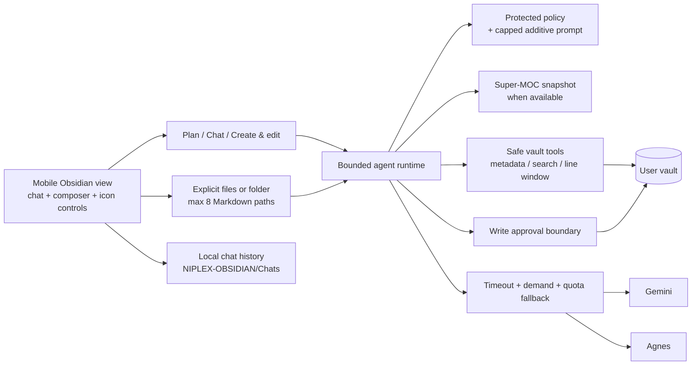
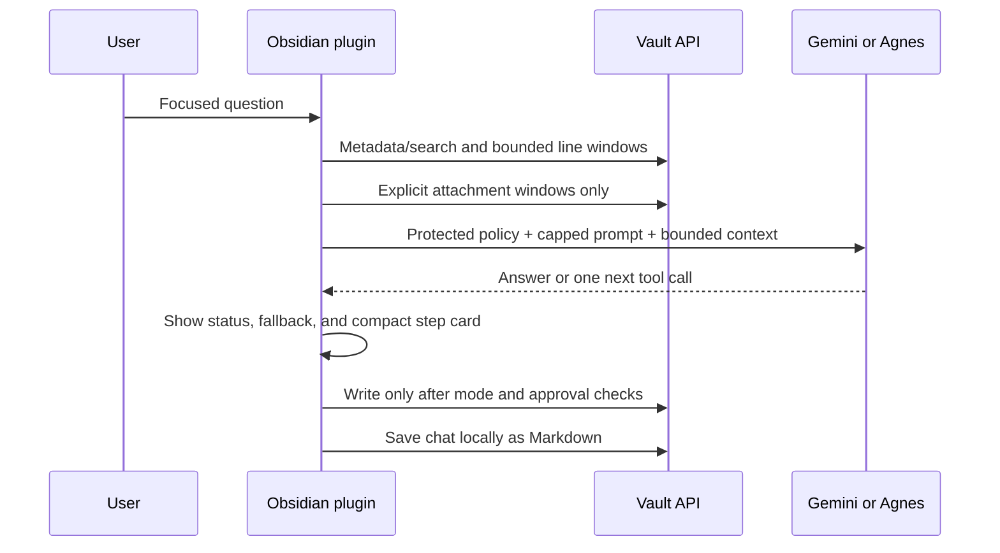

# Niplex Obsidian Research AI

**Niplex Obsidian Research AI** is an autonomous, mobile-first Obsidian plugin for focused research over a user’s own vault. It combines bounded vault discovery, Gemini and Agnes provider adapters, incremental AI-discovered MOCs, explicit context selection, transparent prompts, local chat history, and approval-safe edits.

The plugin is designed for a simple rule:

> The agent should be useful without treating the whole vault as an upload.

It reads metadata, searches narrowly, opens line windows, and follows relevant links step by step. A super-MOC can provide a navigation index, but it is not a license to read every note. Durable edits remain under the user’s control.

## What it does

| Capability | Behavior |
|---|---|
| Autonomous research loop | Plans bounded steps, searches the vault, reads relevant line windows, and returns an evidence-grounded answer. |
| Mobile-first workspace | Keeps the conversation and composer visible while secondary controls live behind **Actions** and compact icon controls. |
| Provider choice | Supports user-entered Gemini and Agnes API keys stored in Obsidian SecretStorage. |
| Recovery from busy models | Rate limits, timeouts, temporary high-demand responses, and model-unavailable responses trigger visible cooldown and same-provider fallback when enabled. |
| Transparent prompt | Shows the protected Aj-Niplex/Niplex policy in a large read-only panel. The additive custom prompt is capped at 6,000 characters and cannot replace the protected policy. |
| Bounded input | Caps the research question at 6,000 characters, installed skill guidance at 6,000 characters, injected context at 20,000 characters, and provider message history at 32,000 characters. |
| Explicit context | The `+` control offers **Files** or **Folder**. A folder adds at most eight Markdown descendants; it does not upload the folder wholesale. |
| Local chat history | Every user turn is saved as readable Markdown under `NIPLEX-OBSIDIAN/Chats/`. The reverse-clock history control opens local search, reopen, and delete actions. |
| Research modes | **Plan** and **Chat** are read-only. **Create & edit** is required before a write tool can be considered, and writes still require approval unless a narrow timed policy is explicitly configured. |
| Quick actions | Users choose up to three icon actions for the left side of the quick bar. The model selector and research-mode selector remain directly beside them. |
| AI-discovered MOCs | Creates category notes with descriptions, supports multi-category membership, and writes a super-MOC under `NIPLEX-OBSIDIAN/MOCs/`. Runs checkpoint and resume instead of looking frozen during long mobile work. |
| Skills | The optional helper installs only reviewed, instruction-only packages after code lookup, digest verification, preview, and explicit approval. |

## Mobile interaction model

The main view intentionally avoids a dashboard full of open controls. The top row contains the title and **Actions**. Under it, the quick-action bar contains up to three user-selected icons, followed by the model selector and the **Plan / Chat / Create & edit** mode selector. The middle of the screen is a large scrollable transcript. The composer is kept low and calm: the chat field sits on the left, while the right-side icon stack contains `+` for context and an arrow for sending.

The `+` control first asks whether the user wants **Files** or **Folder**. Selecting a folder adds only a capped set of Markdown paths as explicit attachments; note bodies remain unread until the run and are still read in bounded windows. The **Actions** sheet contains less-frequent tools such as MOC building, saved-chat management, prompt inspection, logs, and quick-action configuration.

## Architecture



### Context boundary



## Installation from GitHub source

This project is currently distributed as source rather than as a Community Plugins listing or a prebuilt GitHub release asset. The product repository is public; the development repository is private.

1. Clone the [public product repository](https://github.com/Aj-Niplex/Niplex-ovsidian-Research-AI), install dependencies, and build locally.
2. Create a folder named `niplex-agentic-research` inside the target vault’s `.obsidian/plugins/` directory.
3. Copy the locally generated `main.js` together with `manifest.json` and `styles.css` into that folder.
4. Reload Obsidian, enable **Niplex Obsidian Research AI**, and complete the walkthrough.
5. Enter a Gemini or Agnes API key in plugin settings. Keys remain in Obsidian SecretStorage and are never written into `NIPLEX-OBSIDIAN`.

```bash
git clone https://github.com/Aj-Niplex/Niplex-ovsidian-Research-AI.git
cd Niplex-ovsidian-Research-AI
npm install
npm run build
# Copy main.js, manifest.json, and styles.css to your vault’s .obsidian/plugins/niplex-agentic-research/
```

For development, clone the repository, install dependencies, and run the local checks:

```bash
npm install
npm test
npm run build
npm run validate
```

No GitHub Actions workflow or paid runner is required. The local validation script is authoritative for this project.

## Provider setup and recovery

Choose a provider in settings and enter its key through Obsidian’s SecretStorage-backed field. Refresh the provider catalogue before selecting a model. A globally listed model is not proof that the current API key can use it, so the plugin replaces an inaccessible configured model with an account-visible candidate when possible.

When a model is rate-limited, times out, reports temporary high demand, or is unavailable, the transcript immediately shows the model name, reason, cooldown period, and next fallback attempt. The user can retry the last request directly from the error card or switch the model from the quick bar. Authentication and malformed-request errors remain visible as actionable failures instead of being silently retried.

## User-owned workspace

The plugin stores user-facing AI data in the visible vault folder below:

```text
NIPLEX-OBSIDIAN/
├── Chats/       # Readable saved conversations
├── Memory/      # Reserved for user-controlled memory
├── MOCs/        # Generated category maps and super-MOCs
├── Prompts/     # Additive custom prompt mirror
├── Runtime/     # Protected checkpoints and diagnostics
└── Skills/      # Validated helper-installed skill packages
```

API keys are not stored in this folder. The agent cannot read the protected chat, prompt, memory, runtime, or installed-skill folders through its vault tools by default. Generated MOCs remain navigable so they can serve as user-controlled research indexes.

For a cleaner visual graph, manually add `NIPLEX-OBSIDIAN/` to **Graph View → Filters → Excluded folders**. The plugin explains this during onboarding but does not silently change Obsidian’s global Graph View settings.

## Prompt transparency and limits

The **System prompts** view presents the built-in Aj-Niplex/Niplex policy in a large read-only showcase. It explains bounded context, untrusted vault text, privacy boundaries, and approval behavior. The UI cannot edit or replace this protected policy, and the runtime removes historical system messages before injecting exactly one protected policy message at the start of every run.

The user prompt is additive preference text only. It is capped at 6,000 characters, displays a live counter, and is mirrored locally under `NIPLEX-OBSIDIAN/Prompts/`. Provider tokenization differs by model, so the character limits are deliberately conservative rather than pretending to be an exact token count.

## MOCs and long runs

The MOC builder discovers categories from bounded note metadata and excerpts. A note can belong to multiple categories, and every category receives a description. The builder writes category notes and a super-MOC under the configured visible MOC folder. It checkpoints after each note, shows progress, pauses after the current note, and resumes without reprocessing completed notes.

A MOC is a navigation aid, not a whole-vault export. The regular agent still chooses relevant files and reads bounded windows rather than sending every note body in one request.

## Skills and helper plugin

The optional [Niplex Obsidian Helper](https://github.com/Aj-Niplex/niplex-obsidian-helper) provides the marketplace surface. Its default public catalogue is:

```text
https://raw.githubusercontent.com/Aj-Niplex/Niplex-Obsidian-skills/main/catalogue.json
```

Enter a five-character code such as `RSH01`, inspect the returned package, and explicitly approve installation. The helper verifies a SHA-256 digest and writes only `skill.json` and `SKILL.md` into `NIPLEX-OBSIDIAN/Skills/`. After relaunch, the main plugin loads the package as untrusted additive guidance and applies only allowlisted numeric settings patches.

The public catalogue includes nine reviewed research packages (`RSH01`–`RSH09`). The upstream Hermes research directory is vendored under the catalogue repository for inspection with its MIT notice preserved, but it is not a live runtime dependency. Bundled upstream scripts are not executed by Niplex.

## Privacy and security

The plugin sends the focused user question, the protected policy, the capped additive prompt, bounded super-MOC context when available, explicitly selected bounded attachment windows, bounded tool results, and selected conversation messages to the configured provider. It does not index or upload the whole vault. Write tools are separated from read-only tools and are blocked outside **Create & edit** mode.

Diagnostics are intentionally redacted. They may include provider/model events, cooldowns, timeouts, and short error summaries, but not API keys, prompts, model responses, or vault excerpts. Users should still review a diagnostics export before sharing it.

## Current limitations

The plugin still needs physical Android and iOS testing inside a real Obsidian vault. In particular, verify SecretStorage behavior, modal sizing, Graph View instructions, folder attachment ordering, local chat persistence, provider fallback with the user’s keys, and helper authentication against a private fork. The product does not currently run background schedules or automatic vault hooks.

## Repository layout

```text
src/
├── core/
│   ├── agent-runtime.ts       # Bounded tool loop, mode enforcement, and fallback events
│   ├── context-budget.ts      # Shared input-size limits
│   ├── local-vault-store.ts   # User-owned chats, prompts, and skills
│   ├── moc-organizer.ts       # Incremental category discovery and checkpointing
│   ├── system-prompt.ts       # Protected policy and additive prompt composition
│   └── vault-context.ts       # Safe metadata, search, reads, and writes
├── providers/
│   ├── gemini.ts              # Gemini adapter and account-visible catalogue
│   └── agnes.ts               # Agnes adapter and catalogue
├── ui/
│   ├── agent-view.ts          # Mobile workspace and composer
│   ├── action-sheet-modal.ts  # Progressive-disclosure Actions surface
│   ├── attachment-choice-modal.ts
│   ├── chat-history-modal.ts
│   └── file-picker-modal.ts
└── main.ts                    # Obsidian lifecycle and host boundary
```

## Design references

The README structure follows conventions common in maintained Obsidian plugins: a short product statement, feature table, installation and development instructions, privacy notes, troubleshooting, architecture, and licensing. The project specifically reviewed [Claudian](https://github.com/YishenTu/claudian), [Gemini Scribe](https://github.com/allenhutchison/obsidian-gemini), [Smart Connections](https://github.com/brianpetro/obsidian-smart-connections), and [Dataview](https://github.com/blacksmithgu/obsidian-dataview) while keeping this implementation independent of their runtime code.

## License

This project is released under the MIT License. See `LICENSE`.
