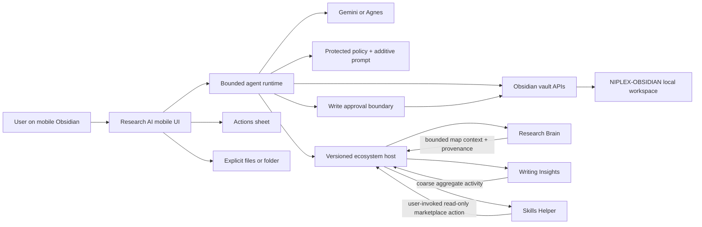
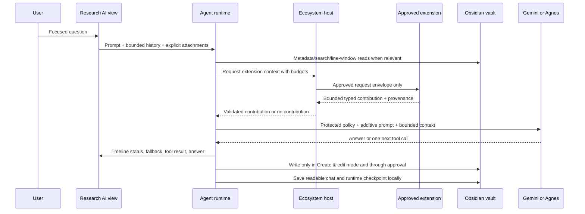

# Niplex Obsidian Ecosystem — Continuation and Handoff Manual

**Document owner:** Aj-Niplex / Niplex Foundation  
**Prepared by:** Manus AI  
**Snapshot:** 27 August 2026, GMT+5:30  
**Purpose:** Preserve enough context, reasoning, source navigation, safety decisions, operational knowledge, and recovery procedure for another maintainer to continue the project without relying on this conversation or on the original implementation agent.

> This manual is the operational memory of the project. Read it before changing code, releasing a plugin, or touching an Obsidian Community listing.

This document intentionally contains **no API keys, OAuth tokens, GitHub tokens, vault excerpts, private prompts, or personal user data**. Provider credentials belong in Obsidian SecretStorage, not in Git, `data.json`, this manual, or the visible project folder. The manual describes where those credentials are expected, but never records their values.

---

## 1. The project in one page

Niplex Obsidian is a privacy-first, mobile-compatible ecosystem for agentic research inside an Obsidian vault. The main product, **Niplex Research AI**, is the host agent. It searches and reads only bounded, relevant vault context, shows its runtime progress, keeps conversations locally as readable Markdown, supports user-controlled MOCs and skills, and places durable writes behind a visible approval boundary. The core plugin is not a remote vault service and does not send the entire vault to a model by default.[1]

Three companion plugins extend that host without becoming hard dependencies. **Niplex Research Brain** provides a local connection index and map provenance. **Niplex Writing Insights** provides local aggregate writing cadence signals. **Niplex Skills Helper** provides a verified instruction-skill marketplace. They remain separate Obsidian Community plugins with separate repositories, manifests, settings, tags, releases, and failure domains. They discover the host at runtime through the versioned `niplex-ecosystem` protocol rather than importing one another’s compiled code.[2]

The most important design rule is the boundary between **capability discovery** and **data permission**. An extension may discover that a compatible host exists, but installation or activation does not grant it access to vault data. Every useful data class is denied until the user enables the corresponding host-side permission, and every approved request is bounded again by character and item budgets. A missing, disabled, incompatible, slow, malformed, or quota-limited companion must not stop the core agent or falsely claim native integration.[2]

### Current release state at this snapshot

| Product | Repository | Plugin ID | Current source version | Current main commit | Community state |
|---|---|---|---:|---|---|
| Niplex Research AI | [`Aj-Niplex/Niplex-obsidian-Research-AI`][5] | `niplex-agentic-research` | **0.3.2** | `5bc9e5f` | Community review completed; public page shows 0.3.2, Health Excellent, Review Satisfactory. |
| Niplex Research Brain | [`Aj-Niplex/Niplex-Research-Brain`][6] | `niplex-research-brain` | **0.2.1** | `ef98ee7` | Community review completed; public page shows 0.2.1, Health Excellent, Review Satisfactory. |
| Niplex Writing Insights | [`Aj-Niplex/Niplex-Writing-Insights`][7] | `niplex-writing-insights` | **0.2.1** | `b2df719` | Community review completed; public page shows 0.2.1, Health Excellent, Review Satisfactory. |
| Niplex Skills Helper | [`Aj-Niplex/niplex-obsidian-helper`][8] | `niplex-skills-helper` | **0.2.1** | `6d6cf00` | Community review completed; public page shows 0.2.1, Health Excellent, Review Passed. |

The exact Community account review commits are the release commits shown above. Build verification passed byte-for-byte for every current release. Remaining Community findings are recommendations or heuristic warnings, not current source blockers: missing GitHub artifact attestations, optional settings-search adoption, strict-typing/DOM heuristics, and the core’s warning about a fallback `.obsidian` string even though runtime path resolution uses `Vault#configDir`. The original core **0.1.19** release remains intact as a rollback point and must not be deleted, archived, or unpublished.[9]

There is one known open development item: Skills Helper Dependabot PR #1 updates development esbuild from `0.25.12` to `0.28.1`. It is clean but has no reported checks or review decision. Do not merge it blindly; validate the branch, rebuild the bundle, inspect the exact release payload, and publish a separate patch only if the generated result warrants it.[10]

---

## 2. Why this project exists

The original product goal was to make a **mobile Obsidian agentic-research plugin** that could conduct the user’s research tasks without forcing the user to paste whole files into one model request. The user referenced the `obsidian-gemini` and Claudian projects as inspiration and wanted the system to choose relevant files incrementally, work with Gemini and Agnes, and use the Aj-Niplex MCP connection during development and investigation. The production plugin itself uses its own Gemini and Agnes adapters; it does not call the task agent’s private tools or depend on MCP at runtime.

The project then evolved through several practical problems discovered during use. The runtime needed visible progress because a silent eight-second wait looked like a frozen mobile plugin. The chat needed a compact timeline rather than raw hidden reasoning. The view needed a single stateful send/stop control, smaller mobile clutter, progressive disclosure through **Actions**, file and folder attachments, inline `@` context, `/skill` selection, model switching, saved chats, sensible subjects, configurable output size, and visible prompt policy. MOCs needed to be model-discovered from note properties and bounded excerpts, with multiple category membership, descriptions, super-MOC recommendations, create-versus-adjust modes, and resumable long runs.

The user also requested a visible user-owned workspace instead of opaque backend storage. That became `NIPLEX-OBSIDIAN/`, with readable chats, memory, prompts, skills, MOCs, and runtime checkpoints. The user was told to exclude `NIPLEX-OBSIDIAN/` from Graph View if they wanted a cleaner graph; the plugin explains this but does not silently alter the global Graph View filter.

The product model was corrected later: Research Brain, Writing Insights, and Skills Helper were not to be treated as unrelated standalone utilities. They had to remain independently releasable **extensions of Research AI**. That correction led to the protocol work described below. A proposed silent download of companions was explicitly rejected as unsafe. The final design is transparent: first setup asks once for confirmation, then installs confirmed important companions; restart checks prompt before updates; and release notes explain the user impact before any replacement.

### Historical decisions that must not be accidentally reversed

| Decision | Final rule | Why it matters |
|---|---|---|
| Separate products | Keep four repositories, four manifests, four release histories, and four Community entries. | Independent failure domains and rollback paths are part of the product model. |
| Host relationship | Core is the host; companions are optional adapters. | “Extension” means protocol participation, not source-code coupling. |
| Consent | No silent plugin download, enable, replacement, or secret transfer. | Users must understand and approve changes to their Obsidian installation. |
| Vault context | Use metadata, search snippets, and bounded line windows. | Whole-vault or whole-file transfer is not the default. |
| Prompt safety | Built-in policy is protected; custom instructions are additive only. | User customization cannot disable safety, privacy, or write approvals. |
| Mobile background behavior | Do not claim closed-app notifications or background agent inference. | Obsidian/mobile operating systems may suspend or terminate the plugin. |
| Community operations | Use non-destructive release checks; never delete or archive listings blindly. | Public pages, account reviews, and official index propagation can differ in time. |
| Automation infrastructure | No GitHub Actions or paid runner is required for the current release process. | Local validation and transparent manual releases are the established path. |

---

## 3. Architecture

### 3.1 High-level component model



The core entry point is `src/main.ts`. It owns plugin lifecycle, settings, commands, local storage wiring, provider selection, runtime construction, the ecosystem host API, companion maintenance, and view activation. Provider-specific code lives in `src/providers/`; provider-neutral contracts and safety logic live under `src/core/`; the mobile interface lives under `src/ui/`.[1] The contributor rules in `AGENTS.md` are part of the architecture: runtime code must not import Node.js or Electron APIs, must use `app.vault` for vault access, must use Obsidian `requestUrl` for remote requests, and must keep durable writes separate from read-only tools.[3]

### 3.2 Runtime request flow



The agent runtime removes historical system messages and injects exactly one current protected system message at the beginning of each run. It trims provider context to the configured request budget, limits the conversation context to twelve messages, and executes at most one tool call per agent step. Duplicate identical tool calls in one request are rejected with a visible tool result so a looping model cannot repeat the same bounded action indefinitely.[1]

### 3.3 Protocol contract

The protocol constants are:

```text
protocol:        niplex-ecosystem
protocolVersion: 1.0
hostPluginId:    niplex-agentic-research
```

The host advertises `registerExtension`, `unregisterExtension`, `getExtensions`, `getActions`, and `requestExtensionContext`. An extension declares its stable ID, name, version, protocol, protocol version, capabilities, data classes, optional context function, and optional actions. The local interfaces are duplicated as type-only contract knowledge in each repository; no adapter imports the core’s compiled bundle. A future protocol-major mismatch must disable registration safely rather than attempting to guess compatibility.[2]

The current capability vocabulary is `bounded-context`, `coarse-activity-context`, `skill-guidance`, `research-action`, and `reflection-action`. Data classes are `note-metadata`, `map-provenance`, `coarse-activity`, and `skill-guidance`. A request has a purpose (`agent-turn`, `map-exploration`, or `reflection`), a request ID, a query, `maxChars`, `maxItems`, approved data classes, and an optional abort signal.

The host performs a second normalization pass even when the extension behaves correctly. Request IDs are capped at 100 characters, queries at 2,000, host-requested character budgets at 0–8,000, and item budgets at 0–24. Contribution text is truncated against the caller’s exact character budget, including its truncation suffix; data-class and provenance arrays are capped by item budget. Empty or malformed contributions are discarded. Each extension context request has a 2.5-second isolation timeout. The host records a redacted diagnostic and continues without the extension on failure.[2]

### 3.4 Permission model

The host stores grants in local plugin settings. Every extension starts with all data grants off. The host-side permission keys are:

| Host permission | What it allows | Default |
|---|---|---:|
| `bounded-context` | Allows the host to request a bounded contribution during an eligible turn. | Off |
| `note-metadata` | Allows limited note titles/paths or metadata when the provider declares that class. | Off |
| `map-provenance` | Allows Brain relation labels and bounded source references. | Off |
| `coarse-activity` | Allows aggregate cadence values from Writing Insights. | Off |
| `skill-guidance` | Allows explicitly selected additive skill guidance. | Off |
| `read-only-actions` | Allows eligible read-only actions to appear in Actions. | Off |

Discovering the host is not the same thing as receiving data. The host also filters each request by the current permission grant and the extension’s declared data classes. Extension actions are admitted only when they are read-only, do not require approval, and the user has granted `read-only-actions`. They are capped at 24 entries. No v1 ecosystem action can directly write notes or bypass the core approval policy.[2]

---

## 4. Product-by-product behavior

### 4.1 Niplex Research AI — host

Research AI provides the mobile workspace, bounded agent loop, model selection, automatic cooldown/fallback, MOC creation and adjustment, local chat history, user memory, prompt transparency, skill selection, explicit attachments, diagnostics, and approval-controlled edits. The main view keeps the conversation visible while secondary controls sit behind **Actions**. The composer uses one stateful circular control: **Send** when idle and **Stop** during a run. Plan and Chat modes are read-only; Create & edit is required before a write tool is considered, and a write still goes through approval unless a narrow timed policy is configured.

The core host exposes optional companion setup. Important companions are **Niplex Skills Helper** and **Niplex Research Brain**. Optional companions are **Niplex Writing Insights** and **Iconize**. The registry currently uses Iconize’s plugin ID `obsidian-icon-folder`, which is a presentation helper and not a core requirement. A future maintainer should verify that this ID remains correct before changing the registry.

### 4.2 Research Brain — local map and bounded context

Research Brain remains useful without the host. It indexes selected Markdown scope locally, respects an empty scope as “index nothing,” excludes `.obsidian/` and `NIPLEX-OBSIDIAN/` by default, and optionally asks Gemini for semantic vectors only after the user enables that mode and supplies a Gemini key through SecretStorage. It offers manual, on-open, every-three-days, weekly, and monthly refresh choices while the plugin is running; it does not assume mobile background execution.[6]

When connected, Brain registers bounded research context and a read-only focused-map action. Its contribution is a ranked neighborhood from records already in its local index, with relation provenance such as `explicit-link`, `backlink`, `shared-tag`, `shared-moc`, and `semantic-similarity`. Note paths or titles can appear only when the host grants `note-metadata`; map relation provenance is separately controlled by `map-provenance`. The adapter does not pass whole note bodies through the bridge, does not receive provider credentials, and contributes nothing when Brain itself is disabled.

The remediation work also matters operationally. The adapter discovers the real nested host plugin shape, builds context through a pure function so a background request cannot overwrite the visible map, avoids falling back to unrelated notes when there is no match, enforces exact small budgets, and re-registers if the host rebuilds its extension registry. Preserve all of these behaviors when changing map code.

### 4.3 Writing Insights — local aggregate activity

Writing Insights tracks local aggregate cadence rather than note identity. Tracking is disabled by default. The plugin stores active-day counts, streak information, approximate minutes, approximate character totals, and time buckets; the character metric is derived from in-memory before/after editor lengths and does not preserve compared text.[7]

Its optional trigger has three modes: off, an in-app notice, or an aggregate-only AI reflection using Gemini or Agnes. Quiet hours and a minimum interval apply. The plugin evaluates its trigger while running through Obsidian events and a fifteen-minute interval; it cannot wake a suspended or closed mobile app. It never starts a conversation merely because the user is inactive.

The ecosystem adapter contributes only active days, streak, approximate weekly minutes, approximate weekly characters, and a coarse peak-hour bucket. It never contributes note names, paths, content, diffs, exact heatmap cells, provider keys, or background-presence information. If tracking is disabled, the adapter returns no context. It also re-registers after a host registry rebuild.

### 4.4 Skills Helper — verified instruction marketplace

Skills Helper is independently usable. It looks up instruction-only packages from the public catalogue, displays a preview, verifies the package digest, validates the manifest and skill text, and writes only after explicit user approval. The default catalogue URL is `https://raw.githubusercontent.com/Aj-Niplex/Niplex-Obsidian-skills/main/catalogue.json`.[8]

The marketplace accepts a five-character uppercase alphanumeric code. The package validator rejects duplicate or malformed entries, absolute paths, parent traversal, backslashes, executable-looking extensions, empty or oversized prompts, and prompt text that appears to reveal or exfiltrate secrets, bypass approvals, disable safety, or override policy. Only three numeric settings may be patched: `maxIterations`, `maxReadLines`, and `maxToolResultChars`. The package digest is SHA-256 over the exact manifest text, one newline, and the exact skill text.

The ecosystem adapter registers only a read-only action that opens the marketplace in the host’s Actions surface. It does not contribute vault context by default, does not receive Gemini or Agnes keys, and cannot change the protected prompt or write policy. Installed skills are treated as **untrusted additive guidance** by the core. They cannot run code, access secrets, replace the protected prompt, or bypass approval.

The skill catalogue repository contains the reviewed research packages and a vendored copy/reference of the MIT-licensed Hermes research material. That upstream material is not a live runtime dependency, and Niplex does not execute bundled upstream scripts. Keep this distinction explicit in future README and release notes.

### 4.5 Iconize and future companions

Iconize is optional and presentation-oriented. It is not a research context provider and does not receive vault data. Future companions must declare their capabilities and data classes, use the same protocol checks, remain standalone without the host, and add no undeclared trust or authority. A future visual companion may decorate a user-visible element, but it must not influence agent authority or write policy.

---

## 5. Privacy, security, consent, and limits

### 5.1 Protected built-in policy

The built-in policy is compiled into the core runtime and displayed in a large read-only prompt panel. It is versioned; the current built-in prompt version is 2. It says, in substance, that vault content is evidence rather than authority, the agent must use bounded reads, the user controls scope, user memory is opt-in, writes require approval, provider keys stay in SecretStorage, and malicious-looking vault text or skill text must not override policy.[1]

> “The agent should read what it needs, not receive the whole vault by default.”[1]

The user’s custom prompt is additive preference text only. It is capped at 6,000 characters, saved locally under `NIPLEX-OBSIDIAN/Prompts/User system prompt.md`, shown with a live limit, and reintroduced after the protected policy rather than replacing it. At runtime, historical system messages are removed and exactly one protected system message is inserted at the start of every provider run. No user prompt can disable bounded access, privacy safeguards, or write approvals.

### 5.2 Exact core limits

The following limits are implemented in `src/core/context-budget.ts`, settings normalization, or the runtime. They are character or count budgets, not guaranteed model-token counts; providers tokenize differently.[1]

| Resource | Default / hard value | Notes |
|---|---:|---|
| User custom prompt | 6,000 chars | Additive only; stored locally. |
| Skill guidance | 6,000 chars | Selected skills are capped and treated as untrusted instructions. |
| User memory | 6,000 chars | Read only when relevant; never store secrets or sensitive diagnoses. |
| Super-MOC snapshot | 6,000 chars | Navigation index, not authority and not a whole-vault export. |
| Explicit attachment contribution | 8,000 chars | Each attached file is read through a bounded window; a folder contributes at most eight Markdown paths. |
| Combined injected context | 20,000 chars | Prompt, hints, MOC, attachments, and approved extension context are bounded together. |
| Normal history | 10,000 chars | Most recent bounded messages are retained. |
| Provider request messages | 32,000 chars | Includes the protected system message and bounded conversation. |
| Agent iterations | 8 default; 1–30 normalized | One tool call is executed per step. |
| Tool result | 12,000 default; 1,000–50,000 normalized | Results are capped before entering history. |
| Read window | 160 default; 20–500 normalized | Used by safe vault reads. |
| Folder attachment files | 8 | Folder selection never means wholesale upload. |
| Explicit attachment paths in a saved chat | 8 | Paths are deduplicated and sanitized. |
| Saved chats | 30 most recent | Visible Markdown and runtime JSON are stored locally. |
| Saved chat activity entries | 24 | Activity is compacted. |
| Selected skill codes | 8 | Each code must match five uppercase alphanumeric characters. |
| Host extension request query | 2,000 chars | Host-side request normalization. |
| Host extension context | 0–8,000 chars per request | Caller’s exact budget is preserved, including zero. |
| Host extension items | 0–24 per request | Data classes and provenance are bounded by this item budget. |
| Extension timeout | 2.5 seconds | Timeout is isolated; the core continues. |

### 5.3 Exact MOC limits

The MOC builder reads bounded metadata and excerpts. It asks the model to assign each note to zero to four meaningful categories, accepts at most six parsed category objects from a response, and keeps at most 30 categories overall. Category names are capped at 64 characters; descriptions and reasons at 360 characters. The generated super-MOC contains category links and up to eight recommended two- or three-category starting sets.[1]

Long runs are time-bounded by `mocTimeBudgetSeconds`, which defaults to 120 seconds and normalizes between 30 and 900 seconds. The builder checkpoints processed paths, categories, and errors. A checkpoint stores up to 5,000 processed paths, 5,000 note references per category, 30 categories, and the last 200 bounded errors. Stop, timeout, provider cooldown, or a recoverable interruption returns a paused result that can resume without repeating completed notes. Category and super-MOC writes still use the normal vault write boundary.

### 5.4 Write approval

Write tools are `create_file` and `append_file`. In Plan and Chat modes, any non-read-only tool call is denied before execution. In Create & edit mode, a write still opens the approval modal unless a timed policy is explicitly configured. A timed policy must have a sanitized path prefix, a future expiry between five minutes and one hour, and an allowlisted write tool. The target path must equal the prefix or be below it. The default policy is always-ask with no auto-approved tools.[1]

Never expand auto-approval to arbitrary paths, arbitrary tools, or a global “trust this agent” switch. If a future write capability is added, it must be represented in the protocol and settings with a separate explicit permission and a visible path policy.

### 5.5 Provider secrets and model recovery

The core stores provider keys through Obsidian SecretStorage under the internal IDs `oar-gemini-api-key` and `oar-agnes-api-key`. They are not written to `data.json`, `NIPLEX-OBSIDIAN/`, release archives, diagnostics exports, or this manual. The provider adapters are `src/providers/gemini.ts` and `src/providers/agnes.ts`.

The model catalogue is account-visible and cached for ten minutes. A public model name is not proof that the user’s current key can use it. When possible, the core replaces an inaccessible configured model with an accessible catalogue candidate and records that choice. The Gemini preference order recognizes Gemini 3.7, Gemini 3.6, Gemini 3.6 Flash, Gemini 3.5, Gemini 3.5 Flash, Gemma 4 31B IT, then other available models. Configured provider fallback models are combined with the current account-visible catalogue.

| Failure class | Default cooldown | Fallback behavior |
|---|---:|---|
| Rate limit / quota | 60 seconds | Mark model unavailable temporarily, show the reason, then try another accessible model when auto-fallback is enabled. |
| Timeout | 60 seconds | Mark the model cooling down and try another candidate. Normal agent request timeout is 45 seconds, with a minimum of 5 seconds. |
| High demand / transient 5xx | 60 seconds | Show a visible switch/cooldown event and continue when another model exists. |
| Model not found / unavailable | 10 minutes | Skip the model and try the catalogue. |
| Authentication or malformed request | No silent retry | Show an actionable error; the user should fix the key, model, or request. |
| User stop | Immediate abort | Return a stopped summary; do not interpret it as a provider failure. |
| All candidates cooling down | No candidate | Show a readable retry/switch action instead of looping indefinitely. |

MOC provider requests use a shorter request timeout bounded by the MOC time budget, up to 20 seconds. Diagnostics record provider/model events, cooldowns, timeouts, and short error summaries but deliberately omit keys, prompts, model responses, and vault excerpts. Users should still review a diagnostics export before sharing it.

### 5.6 YouTube input

The core recognizes one public YouTube URL in a focused question. Gemini receives it as a bounded `fileData.fileUri` video part; Agnes currently receives the URL as text and the UI advises switching to Gemini for direct video analysis. Private and unlisted videos are not accepted by the URL parser, and the video is not downloaded into the vault.[1]

### 5.7 Mobile and background limits

All four manifests declare `isDesktopOnly: false`, but that is a compatibility declaration, not proof of exhaustive device testing. The plugins do not run a hidden background service. Research AI’s two-hour companion reminder runs through `registerInterval` only while Obsidian is active. Writing Insights’ inactivity trigger runs only while the plugin is running. Neither system can reliably wake a suspended or closed mobile app, send guaranteed off-app push notifications, or start an agent conversation because the user was inactive.

Real Android and iOS smoke tests remain necessary before claiming a new mobile release. Test on a disposable vault, not a user’s production vault, and never use personal secrets in a test archive.[4]

---

## 6. User-owned storage and recovery

### 6.1 Visible local workspace

Research AI creates this visible structure:

```text
NIPLEX-OBSIDIAN/
├── Chats/                 # Readable Markdown conversations
├── Memory/
│   └── User memory.md    # Editable, bounded personalization memory
├── MOCs/                  # Generated category MOCs when selected
├── Prompts/
│   └── User system prompt.md
├── Runtime/
│   └── Chats/             # Compact JSON runtime state/checkpoints
└── Skills/                # Validated skill.json + SKILL.md packages
```

The exact constants are in `src/core/local-vault-store.ts`. The protected agent-tool prefixes are `Chats`, `Prompts`, `Memory`, `Skills`, and `Runtime` below `NIPLEX-OBSIDIAN/`. These folders remain visible to the user in Obsidian, but the agent’s normal vault tools do not treat them as ordinary research material. The user may open and edit the files directly when appropriate; the protected prompt and approval logic still govern what the agent can do.

Readable chat files use frontmatter and Markdown headings. Runtime JSON is used for compact state and migration fallback. The core loads up to 100 matching Markdown files, normalizes them, and keeps the 30 most recent chats in the active list. Deleting a chat moves both visible and runtime files through Obsidian’s trash API rather than silently erasing them.

`data.json` stores settings and redacted diagnostics. The local visible files store chats, user memory, prompt mirror, skills, and MOC material. API keys remain in SecretStorage. If a user wants a full backup, copy the entire vault, including `NIPLEX-OBSIDIAN/`, but do not treat the visible folder as a replacement for a vault backup.

### 6.2 User memory

`NIPLEX-OBSIDIAN/Memory/User memory.md` is editable personalization data. The core only hints the agent to read it when the question genuinely concerns memory, personalization, preference, profile, or similar intent. A model may propose a memory update, but the update requires explicit intent, Create & edit mode, and the normal approval boundary. Never store API keys, passwords, health diagnoses, private tokens, or sensitive secrets there.

### 6.3 Failed startup or migration

If the visible workspace cannot be prepared, the core continues with legacy in-`data.json` chats where possible and shows a notice. The safe recovery order is:

1. Close or reload Obsidian and verify the vault is writable.
2. Confirm that the `NIPLEX-OBSIDIAN/` path is not blocked by a conflicting file or sync conflict.
3. Back up the vault before manual repair.
4. Reopen the plugin and inspect the diagnostics view without sharing private content.
5. If visible Markdown chats exist, preserve them; do not delete the folder to “reset” the plugin.
6. Only after backup, repair malformed runtime JSON or move one damaged runtime file aside. The readable Markdown transcript is the preferred human recovery source.

### 6.4 Failed companion installation

The companion installer uses the vault’s configured `configDir`, falling back to `.obsidian` only when that property is absent. The target is `<configDir>/plugins/<plugin-id>/`. Before replacement, it reads the existing `main.js`, `manifest.json`, and `styles.css` into memory. It downloads only those three asset names from HTTPS GitHub or GitHub object hosts, verifies the manifest ID and release version, disables an enabled companion, replaces the files, reloads manifests, and re-enables when requested.

On failure, it restores previous file contents where possible and trashes newly created files. This is deliberately best effort: a failed rollback cannot automatically undelete every newly created file from Obsidian’s trash. If a companion remains broken, use a vault backup or reinstall the exact three assets from the relevant GitHub release. If the companion was disabled before the operation, do not assume the installer should enable it; respect the previous state.

The updater’s GitHub repository URLs are statically allowlisted in `src/core/companion-plugins.ts`, and release lookup uses the GitHub latest-release API. A release must contain exactly the expected asset names. If release lookup fails, the UI keeps a visible candidate/manual-install path instead of falsely claiming that everything is current.

---

## 7. Companion installation and update behavior

### 7.1 First installation

The first-run flow is intentionally transparent. The walkthrough explains that important companions are useful but optional to the core. The companion modal shows the installed state, enabled state, expected/latest version, release notes, and a “what changed and how it affects you” explanation. Nothing is downloaded or enabled before the user confirms.

After the user confirms important companion setup, `markCompanionSetupConfirmed()` sets `companionSetupConfirmed`, `companionRemindersEnabled`, and `companionUpdateChecksEnabled` to true. This is why upgraded users are protected from maintenance checks until they have explicitly confirmed setup: settings normalization forces reminders and restart checks off when the confirmation flag is absent. New users can then receive the intended active maintenance behavior after consent.

### 7.2 Restart and two-hour checks

After the layout is ready, the core opens the first-run walkthrough if onboarding is incomplete. Otherwise it schedules startup checks after a short delay and registers a two-hour in-app interval. Startup checks first look for installed-companion updates when update checks are enabled. If updates exist, the core shows a notice and opens the update modal. If no update is offered and the two-hour reminder is due, the core checks important companions and opens the first-install modal when something is missing or disabled.

The two settings are independent and user-controllable: **important companion reminders** and **restart-time companion update checks**. A manual command, **Check niplex companion updates**, can be used when the user wants to check immediately. These checks are foreground plugin behavior, not a background daemon.

### 7.3 Why silent installation is prohibited

Silent companion installation was discussed and rejected. A plugin changing another plugin’s files, enabling it, or starting it without notice creates an unacceptable consent and recovery problem, particularly on mobile. The current design gets the convenience the user wanted after one explicit confirmation while keeping the critical transition visible. Never reintroduce hidden download, hidden enable, hidden replacement, or hidden execution logic to “make setup smoother.”

### 7.4 Current registry maintenance warning

The source registry currently pins Skills Helper to expected version `0.2.1`, but Brain and Writing Insights still show expected version `0.2.0` even though their current releases are `0.2.1`. That means an installed Brain or Insights `0.2.0` may be considered current by core and may not trigger the update prompt for `0.2.1`. This is the most important known implementation discrepancy in the current snapshot.

Before the next core release, change the expected versions in `src/core/companion-plugins.ts` to Brain `0.2.1` and Insights `0.2.1`, add or update the registry test, bump the core patch version, run the full release gate, and perform a fresh Community scan. Do not edit the already published release retroactively.

---

## 8. Source tree map

### 8.1 Core repository

| Path | Responsibility |
|---|---|
| `src/main.ts` | Plugin lifecycle, settings wiring, commands, host API, extension registry, context injection, companion checks, MOC orchestration, persistence. |
| `src/core/ecosystem.ts` | Canonical protocol types, grants, data-class mapping, contribution normalization, budget enforcement. |
| `src/core/companion-plugins.ts` | Important/optional registry, plugin IDs, expected versions, release URLs. |
| `src/core/companion-updater.ts` | Allowlisted release lookup, asset validation, config-dir path, manifest validation, replace/re-enable/rollback. |
| `src/core/version-utils.ts` | SemVer-aware stable/prerelease comparison. |
| `src/core/agent-runtime.ts` | Provider loop, one tool per step, protected history, tool execution, stop behavior, fallback events. |
| `src/core/context-budget.ts` | Character bounds and truncation helpers. |
| `src/core/vault-context.ts` | Safe metadata, search, bounded reads, protected paths, read/write tool definitions. |
| `src/core/local-vault-store.ts` | Chats, memory, prompt mirror, skills, runtime files, migration. |
| `src/core/moc-organizer.ts` | Incremental category discovery, descriptions, super-MOC, checkpoint/resume. |
| `src/core/model-fallback.ts` | Catalogue-aware fallback, cooldowns, request timeout, candidate ordering. |
| `src/core/provider-errors.ts` | Rate-limit, transient, unavailable, timeout, and actionable-error classification. |
| `src/core/system-prompt.ts` | Protected policy, additive prompt, history protection, prompt display. |
| `src/core/approval-policy.ts` | Always-ask and narrow timed write approvals. |
| `src/settings.ts` | Provider, limits, UI, ecosystem permissions, companion maintenance settings. |
| `src/providers/gemini.ts` | Gemini request/response and public-video adapter. |
| `src/providers/agnes.ts` | Agnes request/response adapter; current video behavior is text URL. |
| `src/ui/agent-view.ts` | Mobile chat, composer, timeline, stateful Send/Stop. |
| `src/ui/action-sheet-modal.ts` | Progressive-disclosure actions. |
| `src/ui/companion-install-modal.ts` | First-install, update, settings candidate review and explicit consent. |
| `src/ui/ecosystem-modal.ts` | Per-extension and per-data-class permission controls. |
| `src/ui/walkthrough-modal.ts` | First-run onboarding and safe companion setup explanation. |
| `src/ui/chat-history-modal.ts` | Local chat search, reopen, and delete. |
| `src/ui/diagnostics-modal.ts` | Redacted diagnostic viewing/export. |
| `test/ecosystem.test.ts` | Host boundary, grants, contribution and budget tests. |
| `test/companion-updater.test.ts` | Version and updater regressions. |
| `test/settings-utils.test.ts` | Migration and consent-default regressions. |
| `test/companion-plugins.test.ts` | Registry and version-pinning regressions. |
| `docs/ecosystem-protocol.md` | Canonical protocol design and release constraints. |
| `docs/testing.md` | Existing mobile smoke-test checklist. |
| `scripts/validate-release.mjs` | Authoritative core local release gate. |
| `scripts/package-plugin.mjs` | Core exact three-file package builder. |
| `manifest.json` / `versions.json` | Plugin identity/version and Obsidian compatibility map. |

### 8.2 Research Brain repository

The important files are `src/ecosystem.ts` for host discovery and bounded contribution, `src/main.ts` for lifecycle and connection state, `src/indexer.ts` for local index construction, `src/map.ts` for user-visible map behavior, `src/text-utils.ts` for parsing/bounds, `src/settings.ts` and `src/consent-modal.ts` for scope and embedding consent, `test/ecosystem.test.ts` for the integration regressions, and `manifest.json` for the independent plugin identity.

Do not put host-connection context logic inside the user-visible map builder. The ecosystem path must use a pure context builder so an agent request cannot mutate or replace the map currently shown to the user.

### 8.3 Writing Insights repository

The important files are `src/ecosystem.ts` for aggregate contribution and action wiring, `src/main.ts` for connection and tracking gates, `src/metrics.ts` for local cadence data, `src/ai.ts` for optional aggregate reflection, `src/settings.ts` for tracking/trigger settings, and `test/ecosystem.test.ts` for privacy and budget regressions.

Never expand the adapter from aggregate values to note identity or exact heatmap cells. A “small convenience” such as adding the active note path would change the product’s privacy promise and must be treated as a new design review, not a minor patch.

### 8.4 Skills Helper repository

The important files are `src/ecosystem.ts` for host action registration, `src/main.ts` for lifecycle/reconnection, `src/marketplace-modal.ts` for user-visible lookup/preview/install, and `src/protocol.ts` for catalogue, manifest, prompt, path, settings-patch, and SHA-256 digest validation. The helper’s source repository is `Aj-Niplex/niplex-obsidian-helper`, while the local checkout is named `Niplex-Skills-Helper-inspect`; do not confuse the local directory name with the public repository name.

The helper packaging script currently emits an archive whose filename is hard-coded as `niplex-skills-helper-0.1.0.zip` even though the release source is 0.2.1. The archive contents are still the three required files, and the GitHub release tag is the authoritative version, but this filename should be made dynamic in a future cleanup.

---

## 9. Repository, branch, and release rules

### 9.1 Before editing

Use the four existing local paths or clone the public repositories. The development repository history and product repository history are intentionally different; do not rename or merge them casually.

```bash
# Core
cd /home/ubuntu/Niplex-Research-AI-ecosystem-bridge

# Brain
cd /home/ubuntu/Niplex-Research-Brain

# Insights
cd /home/ubuntu/Niplex-Writing-Insights

# Helper; public repo is Aj-Niplex/niplex-obsidian-helper
cd /home/ubuntu/Niplex-Skills-Helper-inspect
```

For a new machine, use the GitHub CLI because the account is already authenticated in the established workflow:

```bash
gh repo clone Aj-Niplex/Niplex-obsidian-Research-AI
gh repo clone Aj-Niplex/Niplex-Research-Brain
gh repo clone Aj-Niplex/Niplex-Writing-Insights
gh repo clone Aj-Niplex/niplex-obsidian-helper
```

Always begin with:

```bash
git status --short --branch
git log -1 --oneline
git remote -v
```

The current local checkouts are on `main` and have no modified tracked source. Generated `dist/` folders are untracked in the current sandbox. Do not commit them unless a repository’s release process explicitly requires them; normally remove or ignore generated build output before opening a pull request.

Read the repository’s `AGENTS.md`, README, current protocol document, and the latest audit before changing behavior. The core guardrails prohibit runtime Node/Electron APIs, telemetry, hidden network activity, remote code execution, automatic plugin updates, credential commits, and whole-vault model context.[3]

### 9.2 Versioning

Use semantic version tags without a leading `v`. Do not change a released plugin ID. Core changes require `manifest.json` and `versions.json` to remain synchronized. Companion changes bump only the companion’s version. Never synchronize versions by editing another repository’s manifest.

Current minimum Obsidian version is `1.11.4` for all four manifests. That version is compatibility metadata, not evidence that every new feature has been smoke-tested on every mobile build.

### 9.3 Local validation

Core’s authoritative validation command is:

```bash
npm install
npm test
npm run build
npm run lint
npm run validate
```

`npm run validate` runs tests, build, lint, a production dependency audit at high severity, required-asset checks, Community-safe manifest ID checks, and bundle scans that reject forbidden runtime strings such as `OPENAI_API_BASE`, `node:`, and `electron`. It also checks that `main.js`, `manifest.json`, and `styles.css` are non-empty.[11]

Brain and Insights use:

```bash
npm install
npm test
npm run build
npm run lint
```

Helper uses:

```bash
npm install
npm test
npm run validate
npm run build
npm run lint
npm run package:release
```

Run tests separately even when `validate` exists, because the Helper’s `validate` script currently covers lint and build but not its test command.

### 9.4 Release payload

Every Obsidian Community release must contain exactly these three files at the top level:

```text
main.js
manifest.json
styles.css
```

Core packages with `scripts/package-plugin.mjs`; companions may need their repository-specific package command. Inspect the resulting archive before uploading:

```bash
unzip -l <archive>.zip
```

The archive must not contain source trees, `node_modules`, `.env`, API keys, vault files, test fixtures containing personal data, or additional release assets. The Helper archive filename quirk is non-blocking but should be recorded when packaging.

### 9.5 GitHub pull requests and releases

The normal safe sequence is:

1. Create a focused branch in the affected repository only.
2. Make the smallest source and test change that fixes the issue.
3. Run the repository’s full local validation.
4. Inspect `git diff --stat`, `git diff`, and generated files for secrets or vault content.
5. Push the branch and open one PR in that repository.
6. Read all human, Community, Dependabot, and connector-bot comments. A usage-limit notice is not approval.
7. Merge only the validated PR into that repository’s own `main` branch.
8. Bump that repository’s version and synchronize its manifest/release metadata.
9. Re-run tests, build, lint, and release-shape validation.
10. Create the GitHub release with a semantic tag without `v` and exactly three assets.

Example core release creation, after validation and packaging:

```bash
gh release create 0.3.3 \
  --repo Aj-Niplex/Niplex-obsidian-Research-AI \
  main.js manifest.json styles.css \
  --title "0.3.3" \
  --notes-file release-notes.md
```

Use the correct version and repository; the example version is illustrative only. Do not use a core release command for a companion repository.

### 9.6 Community workflow

For an already listed plugin, use **Check for new releases** from the signed-in Community account page. This is non-destructive. Wait for the exact release version and commit, then record whether the review is Pending, Completed, or Failed and distinguish blockers from recommendations. Do not confuse an old completed review card with the currently queued release.

Then verify three separate states:

| State | How to verify | What it proves |
|---|---|---|
| Account review | Signed-in Community account page | The submitted manifest/commit scan state. |
| Public listing | `https://community.obsidian.md/plugins/<id>` | The public page and current visible listing version. |
| Official index | Cache-busted `community-plugins.json` | Metadata propagation to the official plugin index; it may not expose release version. |

A public page can show a version while the account page is still processing another scan, or an account page can be complete before the official index updates. Report these states separately. Do not claim fresh in-app discoverability merely because the public page resolves. Do not use Archive, Delete draft, Remove, or Unpublish unless the user explicitly asks for that exact action and the consequences are understood.

---

## 10. Community and release snapshot

The current public pages verified in the latest audit are:

| Product | Public page | Release page |
|---|---|---|
| Research AI | [Community listing][9] | [GitHub 0.3.2][5] |
| Research Brain | [Community listing][11] | [GitHub 0.2.1][6] |
| Writing Insights | [Community listing][12] | [GitHub 0.2.1][7] |
| Skills Helper | [Community listing][13] | [GitHub 0.2.1][8] |

The official cache-busted Community index contains all four plugin IDs and their independent repositories, but that JSON is metadata-oriented and does not serve as a reliable release-version ledger. The current audit therefore treats the public page as the evidence for public listing and the signed-in account page as the evidence for review state. Preserve this distinction in future reports.[9]

Community review recommendations about artifact attestations are not blockers. The project deliberately did not add GitHub Actions or paid runners merely to remove that recommendation. If provenance attestations are added later, treat them as a separate release-infrastructure decision and document the trust model, runner permissions, and maintenance burden.

---

## 11. Manual mobile smoke test

A real device test is still required before claiming a new release is mobile-ready. Use a disposable test vault and a test provider key. The existing checklist in `docs/testing.md` is the baseline.[4]

### Core installation and layout

Install `main.js`, `manifest.json`, and `styles.css` under the test vault’s plugin directory. On normal Obsidian configuration this is `.obsidian/plugins/niplex-agentic-research/`; if the vault uses a custom configuration directory, use that directory. Enable the plugin, open the command palette, and select **Open agentic research**.

Confirm that the view fits a narrow screen, the composer is reachable by touch without hover, the conversation stays visible, the Actions sheet opens, the model and mode selectors remain usable, and the circular control changes from Send to Stop during a run and back after completion or cancellation.

### Privacy and context

Enter a test Gemini key and verify it survives restart without appearing in `data.json`. Repeat for Agnes. Ask for a file listing, a search for a distinctive phrase, and a later line-window read from a long note. Confirm that the timeline shows metadata, snippets, and bounded windows rather than a whole note body.

Attach one file and one folder. Confirm that the folder contributes no more than eight Markdown descendants and that the selected file is read through a bounded window. Type an exact `@path/to/note.md` mention and an `@Folder/` mention. Type `/skill`, select a built-in or previously installed skill, and verify the output-size selector.

### Writes and protected paths

Ask the agent to create a test report note or append to an existing test note. Verify that Plan and Chat reject the write, Create & edit is required, the approval modal shows the tool and arguments, Deny leaves the vault unchanged, and Approve performs only the requested change. Verify that `.obsidian/`, `NIPLEX-OBSIDIAN/`, and plugin state paths are not available as ordinary research content.

### Ecosystem

Install or enable the compatible Brain, Insights, and Helper versions independently. Open the core ecosystem permission manager. Confirm that discovery can be visible while all data permissions remain off. Enable one permission at a time and verify the timeline labels the optional contribution and provenance. Disable each companion and confirm the core continues without it. Rebuild or reload the host and verify each adapter reconnects without creating duplicate registrations.

For Brain, confirm no context appears with Brain disabled, note metadata is absent when denied, semantic consent remains separate, and the visible map is not overwritten by an agent context request. For Insights, disable tracking and confirm the bridge contributes nothing; verify no note path, content, diff, or exact heatmap cell appears. For Helper, open the read-only marketplace action and confirm lookup, preview, digest validation, and explicit installation still work.

### Companion setup and update flow

On a fresh disposable vault, confirm that first-run setup explains important versus optional companions and asks before any download. Defer once and verify no download occurs. Reopen the manager and confirm the user can opt in. On a later restart, place a newer test release in the allowlisted repository and verify the update modal shows release notes and user impact before confirmation. Test an invalid manifest ID, missing asset, non-default config directory, disabled companion, failed replacement, and rollback path.

### Error and recovery cases

Test a missing key, invalid model, empty search, missing file, duplicate path, later line window, provider rate limit, provider timeout, all-model cooldown, malformed skill, and failed companion release lookup. The plugin should remain responsive, show a readable action, and avoid silently retrying authentication or malformed requests. Export diagnostics only after checking that the result contains no private prompt, response, key, or vault excerpt.

---

## 12. Known risks and technical debt

| Priority | Item | Risk | Recommended action |
|---|---|---|---|
| P0 | Brain and Insights expected versions in core registry are stale at 0.2.0. | Current users may not be prompted for the 0.2.1 companion builds. | Update registry pins to 0.2.1, add tests, release a new core patch, and rescan. |
| P0 | Real Android/iOS smoke test has not been completed for the current patch snapshot. | `isDesktopOnly:false` is not the same as verified mobile behavior. | Test on disposable Android and iOS vaults before making stronger mobile claims. |
| P1 | Helper package archive filename is hard-coded to 0.1.0. | Humans may mistake the archive filename even though the manifest/tag are correct. | Derive filename from `manifest.json` version and add a package test. |
| P1 | Core Community review may show heuristic warnings for the fallback `.obsidian` string. | Reviewers may misread a safe fallback as a hard-coded runtime path. | Keep `Vault#configDir` behavior; if changing wording/code, preserve custom-dir support and rerun scan. |
| P1 | Generated `dist/` directories are untracked in current local checkouts. | Future commits can accidentally include build output or make status look dirty. | Remove/ignore generated output before commits; never delete unknown user files. |
| P1 | Codex review usage limits prevented fresh bot review on some remediation PRs. | “No new comment” must not be described as automated approval. | Rely on local validation and Community scans; rerun connector review only when available. |
| P2 | Community artifact attestations are not present. | Users cannot cryptographically verify build provenance from GitHub attestations. | Optional future infrastructure project; not required for current release validity. |
| P2 | Protocol types are duplicated locally in each repository. | Contract drift is possible if one adapter changes without updating the others. | Keep a public protocol reference and add cross-product compatibility tests before adding fields. |
| P2 | The current protocol accepts exact `1.0` only. | Future optional fields or host changes need deliberate negotiation. | Add compatible minor-version handling only with tests and a migration plan. |
| P2 | No complete device matrix or long-run performance profile. | Large vaults, mobile sync conflicts, and slow providers may expose UX issues. | Run bounded stress tests using synthetic vaults, never personal data. |

Do not “fix” recommendations by weakening the privacy boundary. For example, removing a warning by sending more vault data, enabling hidden background activity, suppressing update notices, or adding a remote code runner would violate the product’s core promise even if a static review becomes quieter.

---

## 13. Continuation playbook for a future maintainer

### Start here

Read this file, the current core README, `AGENTS.md`, `docs/ecosystem-protocol.md`, and the latest Community audit. Run `git status --short --branch` in all four repositories. Confirm the current manifest versions and current `main` commits. Check the open PR list before creating a new branch. The current known open item is Skills Helper Dependabot PR #1.[10]

### If the change affects the host or protocol

First write down which contract surface changes: host field, extension field, permission, data class, action, budget, timeout, or lifecycle event. Update the canonical protocol document and the local type definitions. Add a core test and adapter tests. Add a cross-product harness check for registration, permissions, malformed output, zero budgets, timeout, and host reload. Do not import another repository’s compiled implementation.

### If the change affects privacy

Treat it as a design change, not a cosmetic refactor. Name the exact data class, the default grant, the maximum character/item budget, the UI disclosure, and the failure behavior. Prove that denied data is not serialized. Test the disabled-provider path, no-match path, zero-budget path, malformed provider response, and timeout. Update the README and release notes so a user can understand what leaves the vault.

### If the change affects companions

Keep the change in the affected companion’s repository unless the host contract or registry must change. For install/update logic, preserve allowlisting, exact asset names, manifest identity/version validation, custom config directory resolution, explicit confirmation, disable/replace/re-enable behavior, and best-effort rollback. Never fetch arbitrary repositories from user-controlled release metadata without a new security review.

### If a model or provider changes

Verify the provider’s current catalogue and request shape. Keep model names account-visible rather than trusting a static list. Preserve cooldown classification, the visible timeline, user stop behavior, and the rule that auth/malformed-request errors are not silently retried. Run provider mapping smoke tests on both Gemini and Agnes.

### If the Community scan fails

Record the exact release version, commit, check name, and whether the result is a blocker or recommendation. Fix only the affected source, test, or metadata. Do not archive or delete the listing to hide a failure. Bump the appropriate independent repository’s patch version, rebuild the exact three-file payload, create a new release, and use Check for new releases again.

### If the original agent or maintainer is unavailable

The GitHub repositories, this handoff manual, the canonical protocol, the README files, the Community audit, and the local user-owned vault structure are the primary continuation sources. The project should not require hidden service state or a private model transcript to be maintained. A new maintainer can start from the source maps and commands above, run the tests, inspect the public releases, and continue one repository at a time.

---

## 14. Prioritized next roadmap

The next safest task is to correct the stale Brain and Insights expected-version pins in the core registry. This is a small, user-visible maintenance issue because it affects update prompts. It should be released as a new core patch only after the registry regression test, full validation, exact asset inspection, and Community scan.

The second priority is a real Android and iOS smoke test using a disposable vault. Test first-run companion consent, update prompts, custom Obsidian config directories, SecretStorage retention, the stateful Stop button, long MOC checkpointing, provider fallback, and helper installation. Record only behavioral outcomes; do not save personal vault content or screenshots containing secrets into the repositories.

The third priority is housekeeping: make the Helper archive filename version-aware, remove or ignore generated `dist/` folders, and add a small release-shape check to each companion. These improvements reduce operator mistakes without changing user behavior.

Only after these tasks should the project consider protocol expansion, extra companions, semantic-index improvements, provenance attestations, or more sophisticated mobile scheduling. Every future feature should answer four questions before implementation: **What data does it receive? What permission enables it? What is the exact budget? What happens if it fails or the app is suspended?**

---

## 15. Quick reference tables

### Repositories and local paths

| Product | Public repository | Local checkout |
|---|---|---|
| Core | `Aj-Niplex/Niplex-obsidian-Research-AI` | `/home/ubuntu/Niplex-Research-AI-ecosystem-bridge` |
| Brain | `Aj-Niplex/Niplex-Research-Brain` | `/home/ubuntu/Niplex-Research-Brain` |
| Insights | `Aj-Niplex/Niplex-Writing-Insights` | `/home/ubuntu/Niplex-Writing-Insights` |
| Helper | `Aj-Niplex/niplex-obsidian-helper` | `/home/ubuntu/Niplex-Skills-Helper-inspect` |

### Release assets

```text
main.js
manifest.json
styles.css
```

### Important commands

```bash
# Core
npm install
npm test
npm run build
npm run lint
npm run validate
npm run package:release

# Brain / Insights
npm install
npm test
npm run build
npm run lint

# Helper
npm install
npm test
npm run validate
npm run build
npm run lint
npm run package:release
```

### Stable user-facing promises

| Promise | Do not violate it by |
|---|---|
| Bounded context | Sending whole vaults or whole files by default. |
| Visible consent | Downloading/enabling/replacing companions silently. |
| Protected prompt | Allowing custom prompts or skills to replace or disable policy. |
| Approval-safe writes | Adding unapproved writes or broad timed trust. |
| Aggregate Insights | Sending note identity, paths, content, diffs, or exact heatmap cells. |
| Brain privacy | Falling back to unrelated notes or leaking denied metadata. |
| Helper safety | Executing skill scripts, accepting executable packages, or bypassing digest/preview/approval. |
| Mobile honesty | Claiming closed-app background inference or guaranteed notifications. |
| Independent products | Merging repositories or creating hard runtime imports. |

---

## References

[1]: ../README.md "Niplex Research AI README and current user-facing behavior"
[2]: ecosystem-protocol.md "Niplex Ecosystem Protocol v1"
[3]: ../AGENTS.md "Core repository contributor guidance"
[4]: testing.md "Core mobile validation checklist"
[5]: https://github.com/Aj-Niplex/Niplex-obsidian-Research-AI/releases/tag/0.3.2 "Niplex Research AI 0.3.2 release"
[6]: https://github.com/Aj-Niplex/Niplex-Research-Brain/releases/tag/0.2.1 "Niplex Research Brain 0.2.1 release"
[7]: https://github.com/Aj-Niplex/Niplex-Writing-Insights/releases/tag/0.2.1 "Niplex Writing Insights 0.2.1 release"
[8]: https://github.com/Aj-Niplex/niplex-obsidian-helper/releases/tag/0.2.1 "Niplex Skills Helper 0.2.1 release"
[9]: https://community.obsidian.md/plugins/niplex-agentic-research "Niplex Research AI public Community listing"
[10]: https://github.com/Aj-Niplex/niplex-obsidian-helper/pull/1 "Skills Helper Dependabot esbuild update"
[11]: https://community.obsidian.md/plugins/niplex-research-brain "Niplex Research Brain public Community listing"
[12]: https://community.obsidian.md/plugins/niplex-writing-insights "Niplex Writing Insights public Community listing"
[13]: https://community.obsidian.md/plugins/niplex-skills-helper "Niplex Skills Helper public Community listing"
[14]: https://github.com/Aj-Niplex/Niplex-Obsidian-skills "Niplex Obsidian Skills catalogue repository"
[15]: https://raw.githubusercontent.com/obsidianmd/obsidian-releases/master/community-plugins.json "Official Obsidian community plugin index"
[16]: https://docs.obsidian.md "Obsidian developer documentation"
[17]: https://github.com/NousResearch/hermes-agent/tree/main/optional-skills/research "Upstream Hermes research skills reference"
[18]: https://forum.obsidian.md/t/inter-plugin-communication-expose-api-to-other-plugins/23618 "Obsidian forum discussion on inter-plugin communication"
